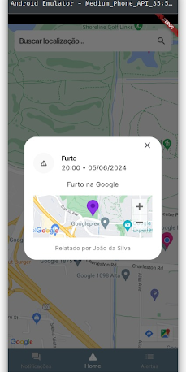

# ei, vizinho!

A Piauian app focused on neighborhood security 🌵

## Related

Reach the main repository of [ei vizinho](https://github.com/liviaalves00/Engenharia-de-Software-III) project

## Features

- Alerts CRUD
- Map preview of alerts
- Notifications

## Screenshots

| Tela Principal                                 | Tela de Listagem                              | Tela de Alerta                                |
| ---------------------------------------------- | --------------------------------------------- | --------------------------------------------- |
|  |  |  |

## Environment Variables

To run this project, you will need to add the following environment variables to your .env file

`BASE_URL`

`GOOGLE_API_KEY`

## Run Locally

Clone the project

```bash
git clone https://msruan/eivizinho-app
```

Go to the project directory

```bash
cd eivizinho-app
```

Install dependencies

```bash
flutter pub get
```

Run the app

```bash
flutter run
```

## Authors

- [@biancabzra](https://www.github.com/bianca-bezerra)
- [@liviaalves](https://www.github.com/liviaalves00)
- [@meidesu](https://www.github.com/meidesu)
- [@msruan](https://www.github.com/msruan)

<!--
## Support

For support, email alma-team@gmail.com.
 -->
<!--
## Feedback

If you have any feedback, please reach out to us at alma.team@gmail.com
 -->
